# Introduction
This repository contains code for statistical analysis of wildfires in California (CalFire) from 2004--2024.

# Data
## Wildfires
Californias Department of Forestry and Fire Protection provides data on historical wildfires available via [arcgis-server](https://data.ca.gov/dataset/california-historical-fire-perimeters). The dataset is filtered for the time period 2004--2024 and for 'OBJECTIVE' 'Suppression (Wildfire)'.  
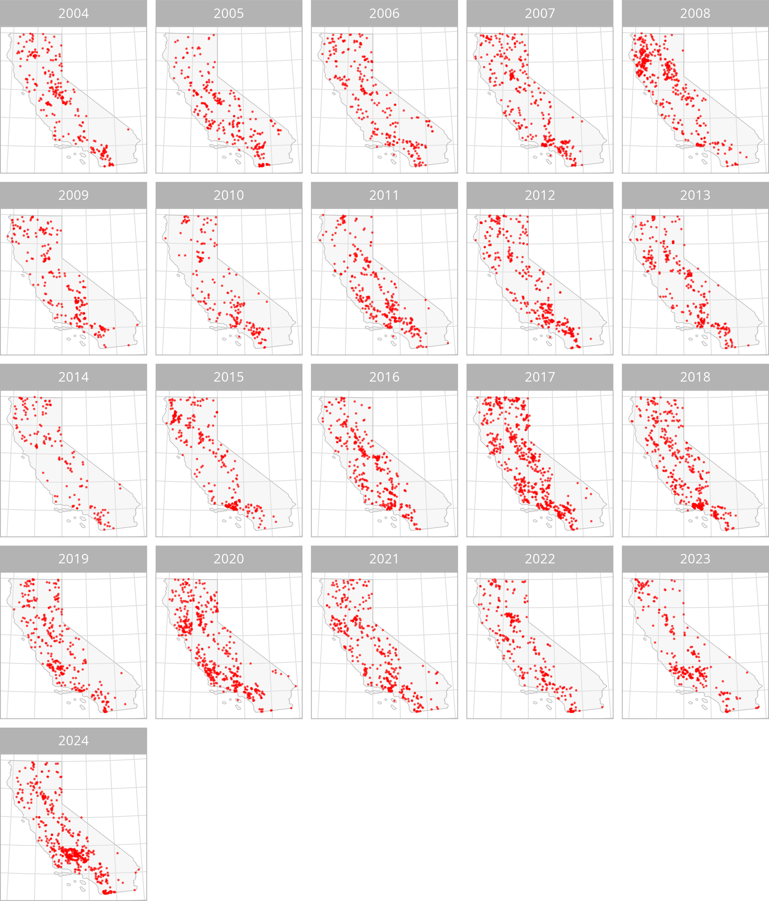  

    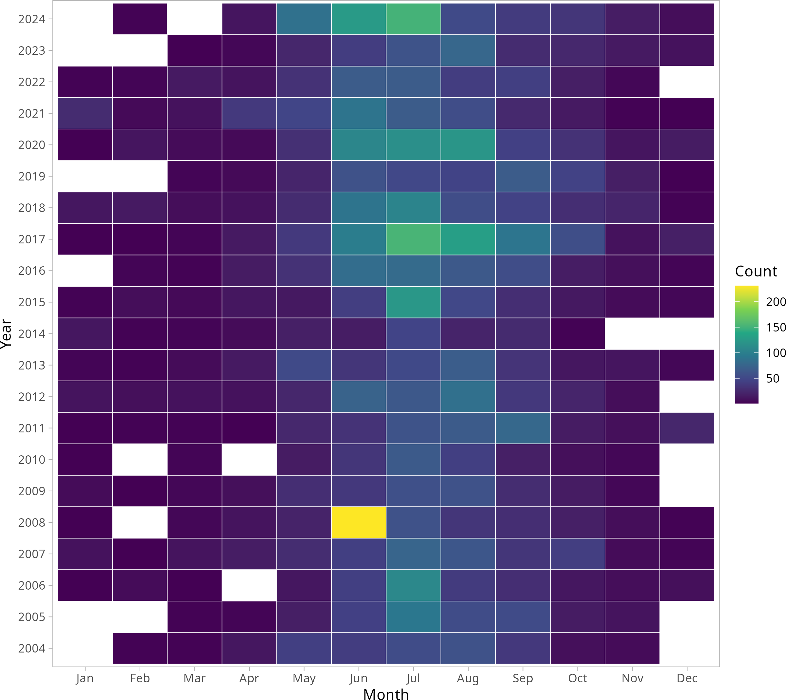
    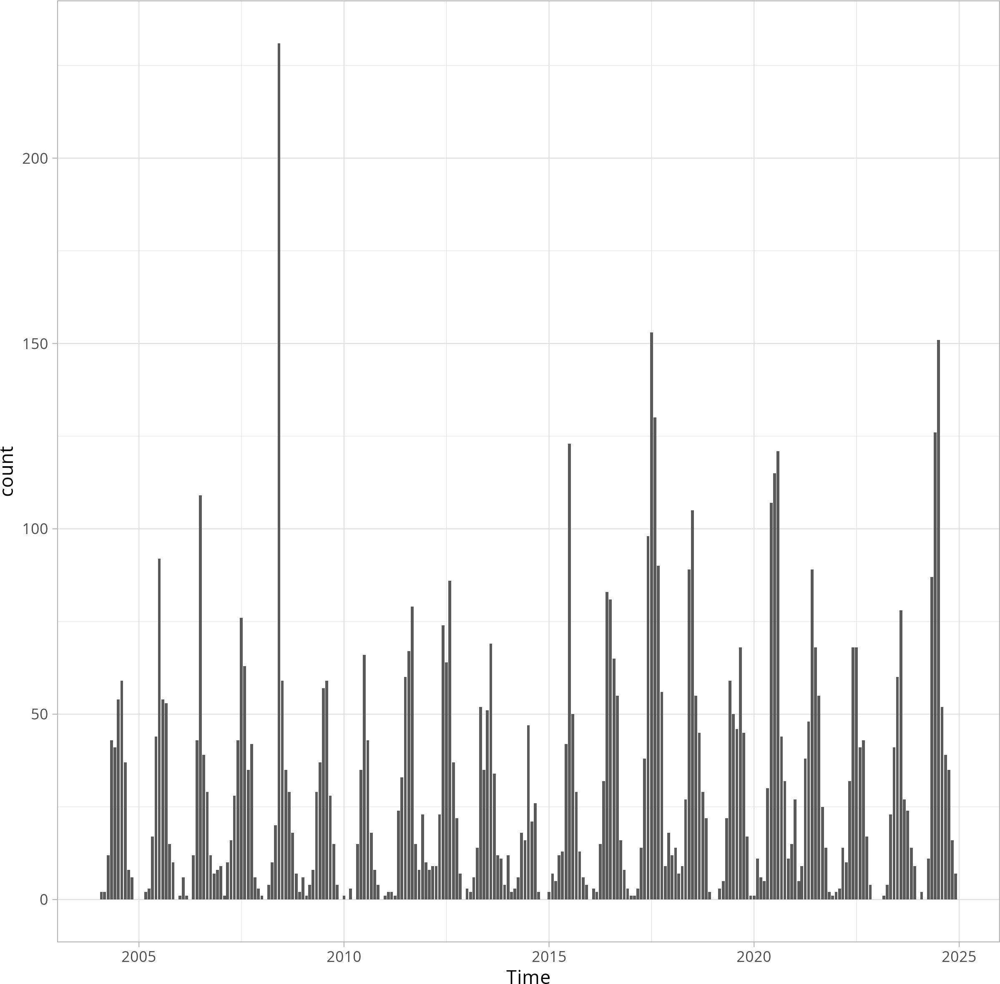

## Meterological Covariates
Meterological data is obtained from [PRISM-Group](https://www.prism.oregonstate.edu) at Orgegon State University. The variables considered are precipitation(ppt), maximal air temperature(tmax) and vapor pressure deficit(vpd).
  
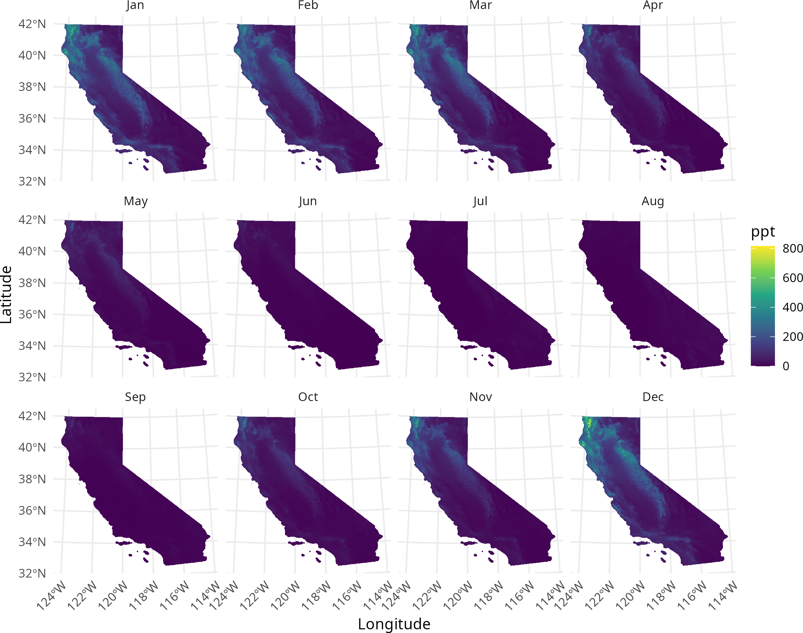
  
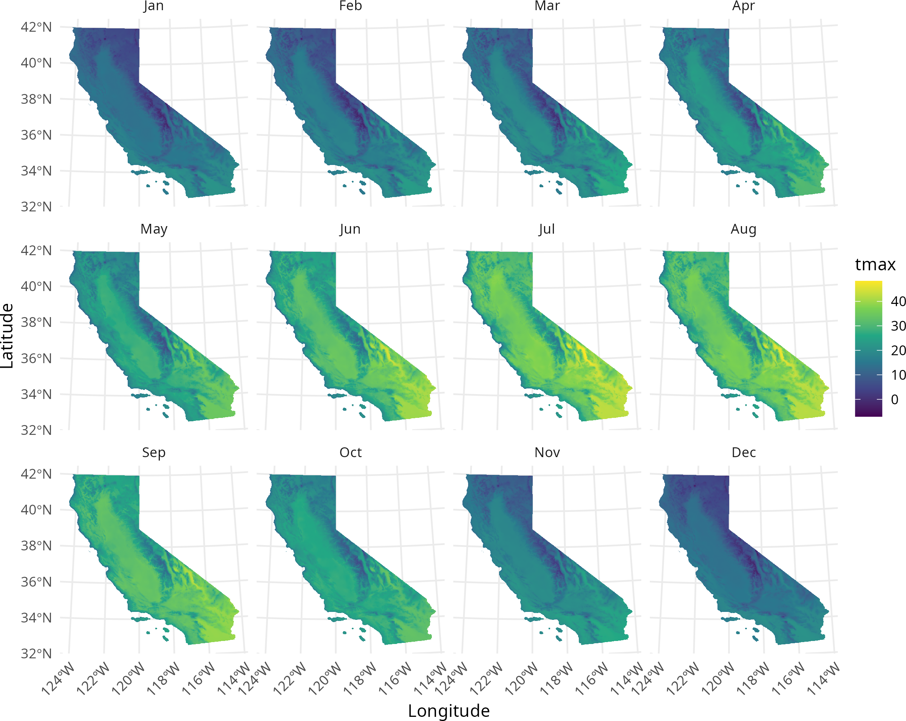
  
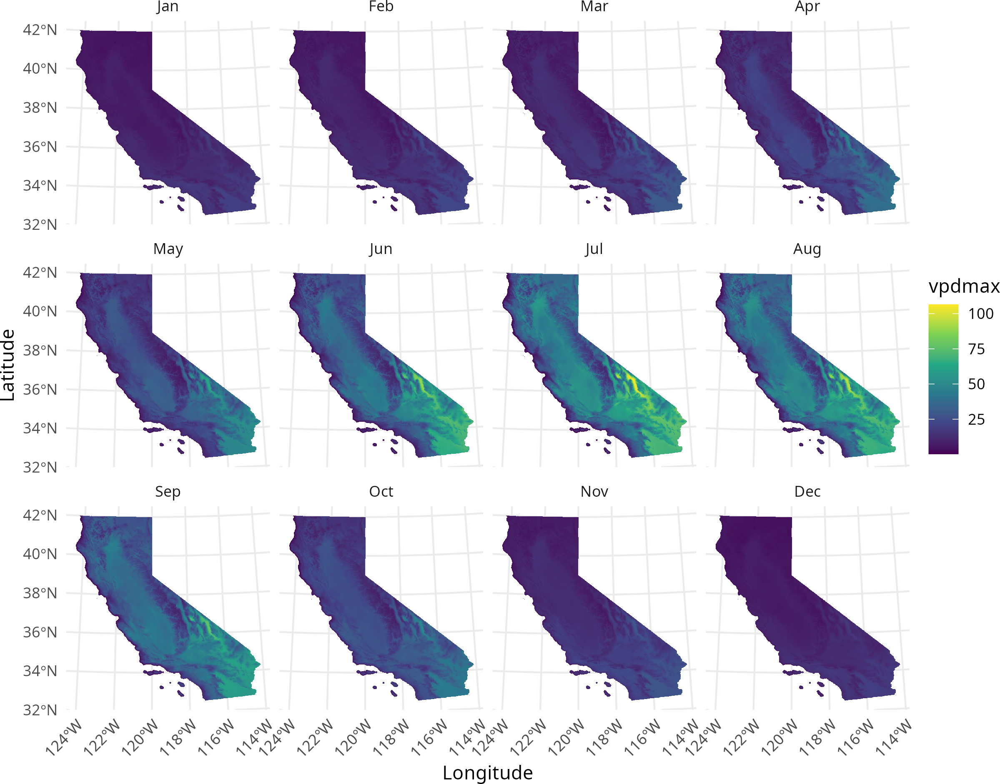
  
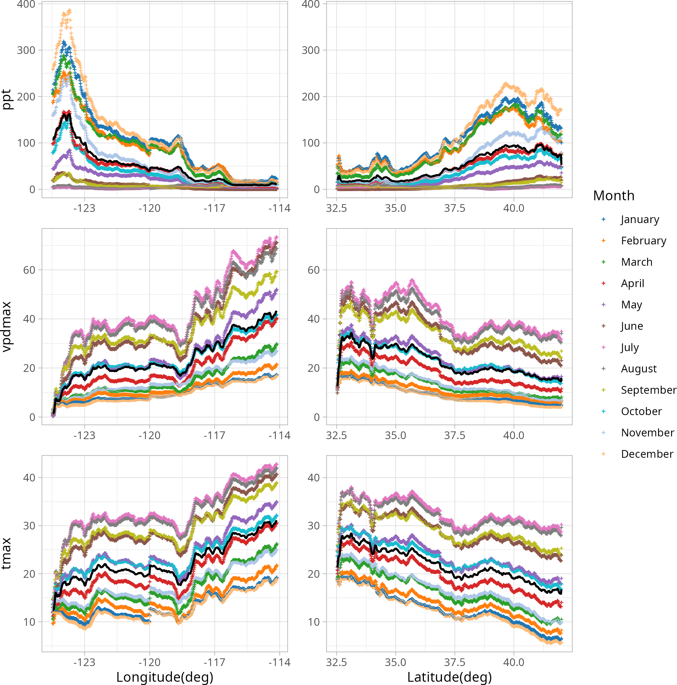

## Topographical Covariates
Making use of satellite images provided by [NASA(MODIS)](https://modis.gsfc.nasa.gov) LAI (Leaf Area Index), a measure of vegitational/biomass coverage and EVI (Enhanced Vegitational Index), a measure of fuel potential are included.
  
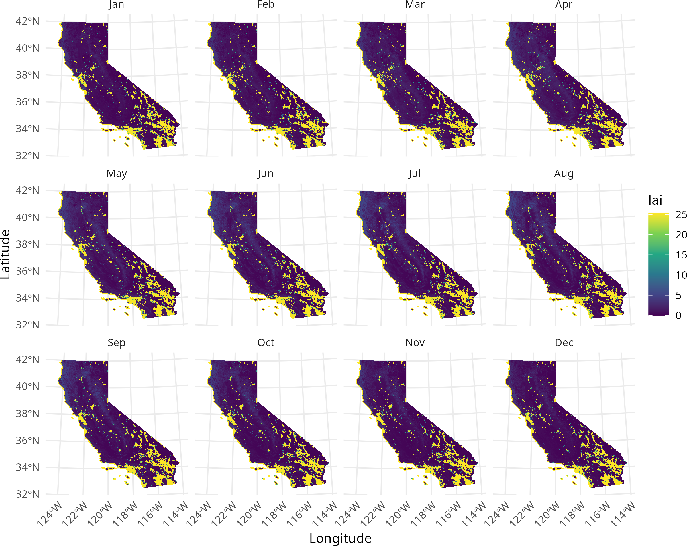
  
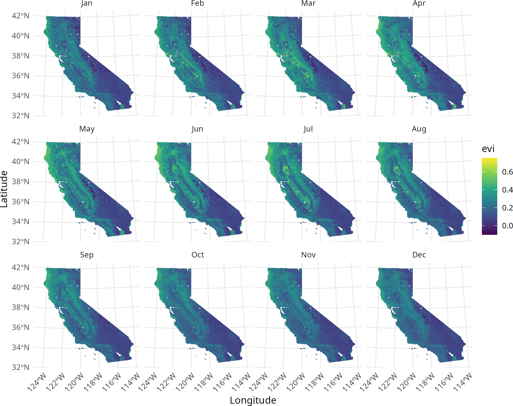
  
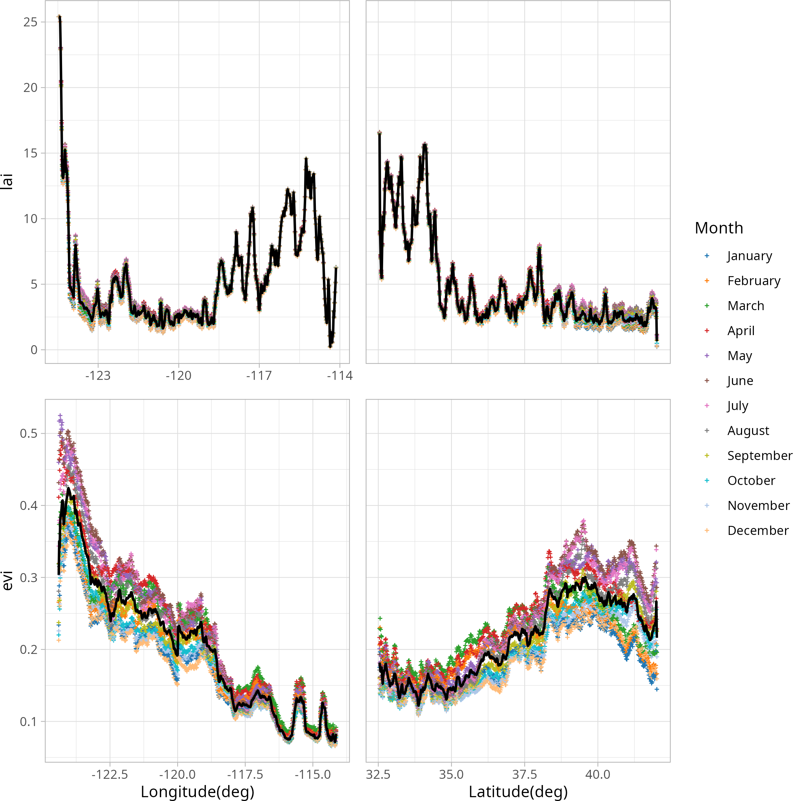

## Other covariates
Other covariates include Elevation, obtained from [NASAs DEM]() and derived from this aspect and slope. To take human activity(arson) into account pixelwise road density from californias road network was constructed.

    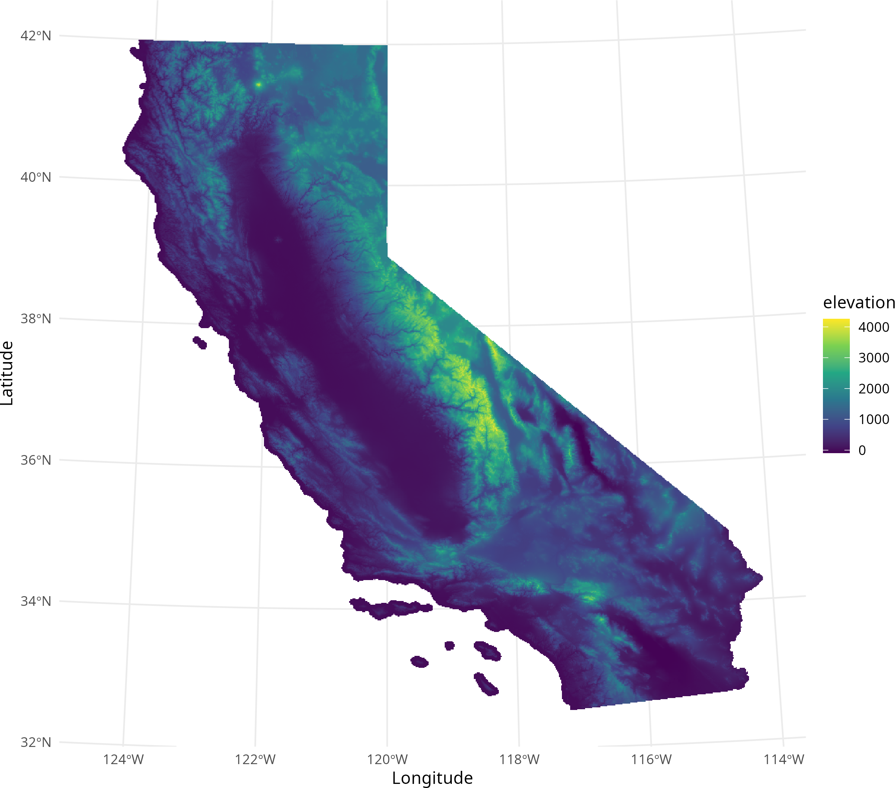
    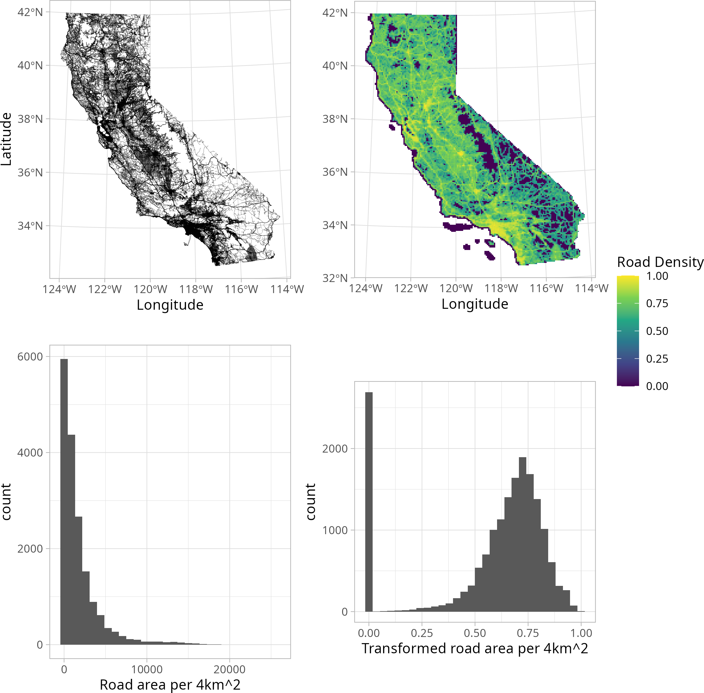

# Model
The aim is to setup three consecutive point process models: a baseline inhomogeneous Poisson Process, a Log-Gaussian-Cox-Process(LGCP) and a Hawkes Process to model wildfire intensity. The statistical model framework is a bayesian hierarchical structure that is estimated using [INLA](https://www.r-inla.org).